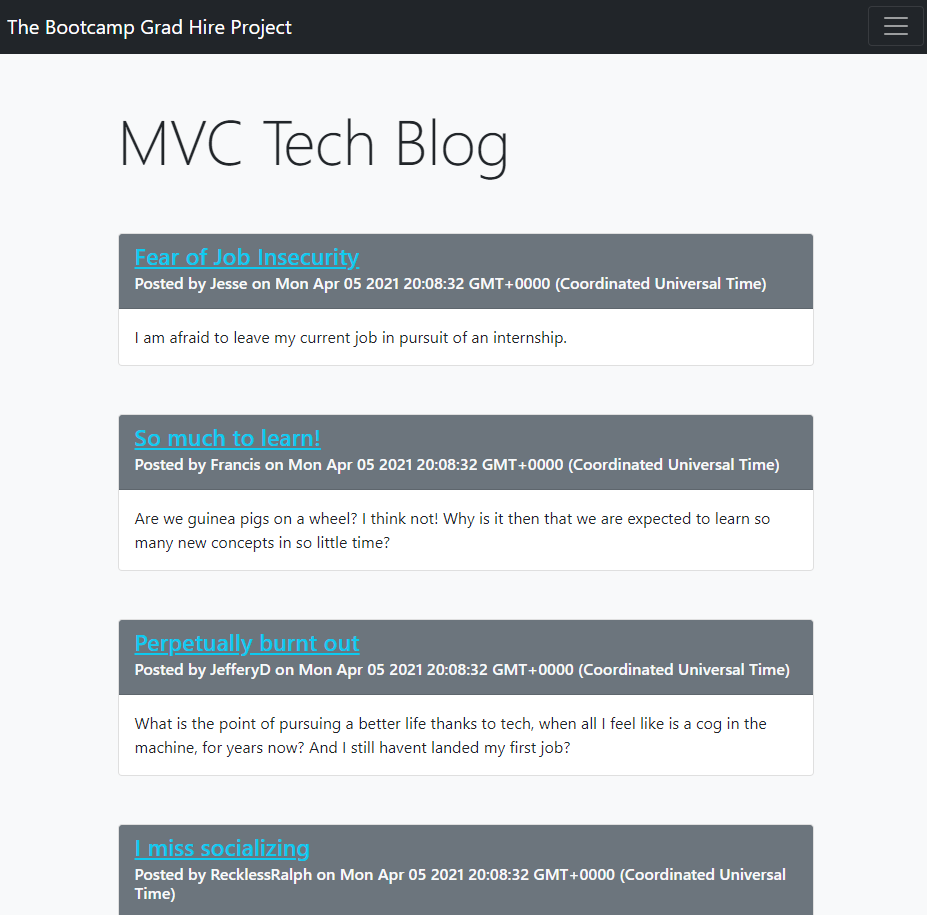

# Tech Blog

# Model View Controller Practice

## Description 
>*A project to practice separation of concerns (Model View Controller - MVC) as well as learn how to use the Handlebars.js templating engine.*
[View Deployed Version Here](http://mvc-unh.herokuapp.com/)
-----------

-----------
## Table of Contents

* [Installation and 'How to' Video](#installation)

* [Usage](#usage)

* [License](#license)

* [Contributing](#contributing)

* [Tests](#tests)

* [Resources](#resources)

* [Questions](#questions)

-----------
## Installation 
If you would like to install this project on your local computer, make sure you have a database you can run the seeds into. Seeds are sample rows for each model (table), to give you some starter data. Reading the package.json will go a long ways, so of course, make sure you read the script and seeds code, as well as run an npm install.

This project is hosted on Heroku and utilizes JawsDB. The .env is not uploaded to GitHub for security reasons, but to fully replicate this website on a cloud-based platform, you will need to generate a connection string in order to seed the data through a database on such a platform as Heroku. I did so from .env with JawsDB.

-----------

## Usage 
 

-----------

## License 
This project was created under the MIT License.

-----------

## Contributing 
 

-----------

## Tests 
 

-----------

## Resources
[Sequelize Model Configuring](https://sequelize.org/v5/manual/models-definition.html#configuration)
 
[What is express-sessions](https://alialhaddad.medium.com/the-basics-of-express-sessions-and-why-to-use-it-4acf0b0cbaf1)
 
[Connect Session Store using Sequelize](https://www.npmjs.com/package/connect-session-sequelize)
 
[express-session](https://www.npmjs.com/package/express-session)
 
[Status Code Definitions](https://www.w3.org/Protocols/rfc2616/rfc2616-sec10.html)
 
[Bootstrap 5 Login Example](https://getbootstrap.com/docs/5.0/examples/sign-in/)
 
[MDN HTTP Status Docs](https://developer.mozilla.org/en-US/docs/Web/HTTP/Status/500)
 
[foreignKey Sequelize](https://sequelize.org/master/class/lib/model.js~Model.html#static-method-hasMany)
 
[Markdown Cheatsheet](https://github.com/adam-p/markdown-here/wiki/Markdown-Cheatsheet)
 
[Sequelize v3 Clean Documentation](https://sequelize.org/v3/docs/associations/#:~:text=foreignKey%20will%20allow%20you%20to,key%20in%20the%20through%20relation.&text=Of%20course%20you%20can%20also,Person.)
 
[Sequelize Associations](https://sequelize.org/v3/api/associations/)
 
[Sequelize Querying](https://sequelize.org/v3/docs/querying/)

[Sequelize Model Basics](https://sequelize.org/master/manual/model-basics.html)

[Sequelize Getters and Setters](https://sequelize.org/master/manual/getters-setters-virtuals.html)
 

 
-----------

## Questions 
GitHub: https://github.com/Pythonidaer

For additional information, please reach out to codefolio.work@gmail.com

 